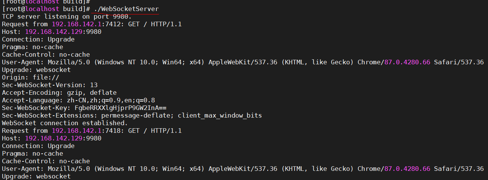
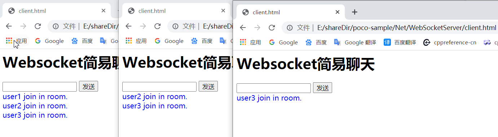

#### WebSocketServer 说明

1. 代码功能逻辑，请参考《TcpClient&&TcpServer-Readme.md》。

2. WebSocketServer.cpp 使用 poco库实现了websocket server端；client.html 使用 JS 实现了 web client端。

3. WebSocketServer运行于centos 7中，如下截图：

   

   client在Chrome浏览器中打开，如下截图：

   
